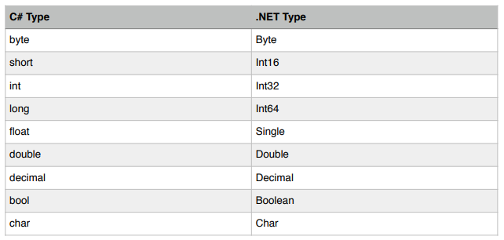

# C#

# C# vs .NET

C# bir programlama dilidir, .NET ise bir çerçevedir. Uygulama oluşturmak için kullandığımız bir çalışma zamanı ortamı (CLR) ve bir class kütüphanesinden oluşur.

# CLR

Bir uygulamayı derlediğinizde, C# derleyicisi kodunuzu IL (Intermediate Language) koduna derler. IL kodu platform agnostiğidir, bu da bir C# programını farklı donanım mimarisine ve işletim sistemine sahip farklı bir bilgisayarda alıp çalıştırmayı mümkün kılar. Bunun gerçekleşmesi için CLR'ye ihtiyacımız var. Bir C# uygulamasını çalıştırdığınızda, CLR IL kodunu üzerinde çalıştığı bilgisayarın yerel makine koduna derler. Bu işleme Tam Zamanında Derleme (JIT) adı verilir.

# .NET Uygulamalarının Mimarisi

Mimari açıdan, C# ile yazılmış bir uygulama class adı verilen yapı taşlarından oluşur. Bir class, data (attributes) ve methods (functions) için bir kapsayıcıdır. Attributes uygulamanın durumunu temsil eder. Methods kod içerir. Mantıkları vardır. Algoritmalarımızı uyguladığımız ve kod yazdığımız yer burasıdır.

namespace, ilgili class'lar için bir kapsayıcıdır. Dolayısıyla, uygulamanızın boyutu büyüdükçe, daha iyi bir yönetim için ilgili class'ları çeşitli namespaces'lere gruplamak isteyebilirsiniz.

class'ların ve namespaces sayısı daha da arttıkça, ilgili namespaces'leri fiziksel olarak ayrı assembly'lere ayırmak isteyebilirsiniz. Bir assembly , bir veya daha fazla ad alanı ve class içeren bir dosyadır (DLL veya EXE). EXE dosyası çalıştırılabilen bir programı temsil eder. DLL, farklı programlar arasında yeniden kullanılabilen kod içeren bir dosyadır.

# Primitive Types and Expressions (İlkel Türler ve İfadeler)

## Variables and Constants (Değişkenler ve Sabitler)

Değişken, bellekteki bir depolama konumuna verdiğimiz addır. Değişkenleri saklamak için kullanırız,bellekteki geçici değerlerdir.
Sabit, değiştirilemeyen bir değerdir. Sabitleri bir değerin değişmeyeceğinden emin olduğumuz zaman kullanırız. Örneğin, bir dairenin alanını hesaplamanız gerekiyorsa, Pi sayısını (3,14) kullanmanız gerekir. Pi sayısını şu şekilde tanımlayabilirsiniz. (const Pi = 3.14)

Bir değişken tanımlamak içinse, bir tür ve bir tanımlayıcı belirtiriz:

"int number;"

Burada int, 4 bayt bellek alan tamsayı türünü temsil eder.
"number" değişkenimiz için tanımlayıcıdır. İsteğe bağlı olarak bir değişkenin değerini
bildiririz. Buna “bir değişkeni başlatma” denir:

"int sayı = 5;"

Unutmayın: C#'ta, daha önce ayarlamadığınız sürece bir değişkenin değerini okuyamazsınız.

## Primitive Types


Bu türlerin .NET Framework'te eşdeğer bir türü vardır. Böylece uygulamanızı derlediğinizde, derleyici türlerinizi .NET Framework'teki temel türle eşler.



Int* türlerini ezberlemenin kolay yolu, her türün kullandığı bayt sayısını hatırlamaktır.Örneğin, bir “short” 2 bayt alır. Her baytta 8 bitimiz vardır. Yani bir “short” 16 bayttır, dolayısıyla temel .NET türü Int16'dır.
Ayrıca ilkel olmayan birkaç türümüz (string, array, class, struct) vardır ve aşağıda anlatacağız.

## Scope

Scope, bir değerin nerede anlam taşıdığını ve erişilebilir olduğunu belirler. Bir değişkenin scope'u bloğunda ve herhangi bir alt blokta tanımlanır. Ancak bu bloğun dışında erişilebilir değildir. Bir blok küme parantezleri ({ }) ile gösterilir.

## Overflowing

Her tip, kendisine tahsis edilen tip sayısına bağlı olarak, bir değer aralığını saklayabilir. Eğer biz bir değişkende bir değer depolarsak ve bu değer temel tür için değer sınırını aşarsa, overflowing meydana gelir.
Örneğin, 0 ile 255 arasındaki herhangi bir değeri bir baytta saklayabiliriz. Eğer
Hesaplamalar sırasında bir baytın değeri bu sınırı aşarsa taşma meydana gelir. İşte bir örnek:

bayt b = 255;
b = b + 1;

İkinci satırın sonucu olarak, b'nin değeri 0 olacaktır.

## Type Conversion (Tip Dönüştürme)

Bir değişkenin değerini geçici olarak farklı bir türe dönüştürmeniz gereken zamanlar olabilir. Bu dönüşümün orijinal değişkeni etkilemediğini unutmayın. Bir değişkenin türünü bir kez bildirdiğinizde, bir daha değiştirebilirsiniz. Ancak, bir değişkene değer atamanın bir parçası olarak o değişkenin “değerini” dönüştürmeniz gerekebilir.
Birkaç dönüştürme senaryosu vardır:
Türler uyumluysa (örn. integral sayılar ve gerçek sayılar) ve hedef tür daha büyükse,
hiçbir şey yapmanıza gerek yoktur. Değer çalışma zamanı tarafından otomatik olarak dönüştürülecek.

byte b = 1;
int i = b;

Burada b bir bayt olduğundan ve yalnızca 1 bayt bellek kapladığından, onu kolayca bir int'e dönüştürebiliriz, Bu da 4 bayt alır. Bu yüzden bir şey yapmamıza gerek yoktur.
Ancak hedef tip kaynak tipten küçükse derleyici bir hata üretecektir.
Bunun nedeni, dönüşümün bir parçası olarak overflowing meydana gelebilmesidir. Örneğin, eğer değeri 1000 olan bir int değerine sahipseniz, bunu bir baytta saklayamazsınız çünkü bir baytın alabileceği maksimum değer 255'tir. Bu durumda, bazı bitler bellekte kaybolacaktır. İşte bu nedenle derleyici sizi bu senaryolar hakkında uyarır. Dönüştürmenin bir parçası olarak hiçbir bitin kaybolmayacağından eminseniz derleyici dönüşümü yapar. Bu durumda, şunu kullanırsınız:

int i = 1;
byte b = (byte)i;

Bu örnekte, int değerimiz 1 değerini tutar ve bu değer mükemmel bir şekilde bir baytta saklanabilir. Yani burada i değişkenini ikinci satırda bir bayta dönüştürüyoruz.
Son olarak, kaynak ve hedef tür uyumlu değilse (örneğin bir string ve bir sayı), şunları yapmanız gerekir:
"Convert" sınıfını kullanın.

string s = “1234”;
int i = Convert.ToInt32(s);

Convert sınıfı, değerleri çeşitli türlere dönüştürmek için bir dizi yönteme sahiptir.

!!Operatör konusu zor bir konu olmadığı için not almadım.

# Non-primitive Type

## Classes

Classes uygulamalarımızın yapı taşlarıdır. Bir Class, ilgili değişkenleri (fields, attributes  veya properties olarak da adlandırılır) ve functions (methods) bir araya getirir.

Not: fields  ve attributes C#'ta teknik olarak farklıdır ancak kavramsal olarak aynı anlama gelirler. Bir class hakkındaki nitelikleri temsil ederler.
Bir object , bir class'ın örneğidir.
Bir sınıf oluşturmak için:

```csharp
public sınıf Kişi
{

}
```

Burada public, erişim değiştiricisi olarak adlandırdığımız şeydir. Bir sınıfın diğer sınıflar tarafından görülebilir olup olmadığını belirler.

İşte bir fields'ı ve bir method olan bir class:

```csharp
public class Person
{
  public string Name;

  public void Introduce()
  {
    Console.WriteLine("Benim adım ” + Name);
  }
}
```

Burada void, bu yöntemin bir değer döndürmediği anlamına gelir.Bir nesne oluşturmak için new operatörünü kullanırız:

```csharp

Person person = new Person();
```

Aynı kodu yazmanın daha temiz bir yolu şudur:

```csharp
var person = new Person();
```

Bir nesneye bellek ayırmak için new operatörünü kullanırız. C#'ta şu konuda endişelenmenize gerek yoktur. Bellekte yer ayırma. CLR'nin Garbage Collector adlı bir bileşeni vardır ve bu bileşen otomatik olarak kullanılmayan nesneleri bellekten kaldırır.

Bir nesneye sahip olduğumuzda, alanlarına ve yöntemlerine nokta gösterimi ile erişebiliriz:

```csharp
Person person= new Person();
person.Name = "Mücahid";
person.Introduce();
```

## Structs

Bir struct (yapı), sınıfa benzer bir türdür. İlgili alanları ve yöntemleri bir araya getirir.

```csharp
public struct RgbColor
{
  public int Kırmızı;
  public int Yeşil;
  public int Mavi;
}
```

Yapıları yalnızca küçük ve hafif nesneler oluştururken kullanın. Bu ince bir performans içindir. Gerçek dünyada, zamanın %99'unda, sınıfları kullanarak yeni tipler oluşturursunuz. NET'te tüm ilkel tipler bir yapı olarak bildirilir. Küçük ve hafiftirler. Bu en büyük ilkel tip 16 bayttan fazla yer kaplamaz.

## Arrays

Dizi, aynı tipteki değişkenlerin bir koleksiyonunu saklamak için kullanılan bir veri yapısıdır. Örneğin, (birbiriyle ilişkili) üç int değişkeni bildirmek yerine, bir int dizisi oluşturabiliriz. Bunun gibi:

```csharp
int[] numbers = new int[3];

//OR

var array = new int[5];
var array = new int[5]{1,2,3,4,5};
```

C#'ta dizi aslında Array sınıfının bir örneğidir. İşte bu yüzden burada "new" işlecini kullanarak bu nesneye bellek ayırır.
Burada, 3 sayısı dizinin boyutunu belirtir. Bir dizi oluşturulduktan sonra boyutu değiştirilemez. Dinamik boyuta sahip bir listeye ihtiyacınız varsa, "List" sınıfını kullanmanız gerekir. Bir dizideki elemanlara erişmek için köşeli parantez gösterimini kullanırız:

```csharp
numbers[0] = 1;
```

C#'ta dizilerin sıfır indeksli olduğunu unutmayın. Yani ilk elemanın indeksi 0'dır.

Length ⇒ Dizideki eleman sayısını verir
Clear(); ⇒Dizinin elemanlarını varsayılan değere çeker

Clone(); ⇒ Dizini bit bit kopyasını çıkarır
Copy(); ⇒Dizinin bir bölümünü başka bir diziye kopyalar
IndexOf(); ⇒Dizi içerisindeki bir değerin ilk görüldüğü indeksi verir
Reverse(); ⇒ Diziyi ters çevirir
Sort(); ⇒ Sıralama yapar.

gibi metotları vardır. Birkaç kullanım örneğine bakalım;

```csharp
var numbers = new[] {2,4,5,8,9,5};
var index = Array.IndexOf(numbers,9);
Array.Clear(numbers,0,3);
```

## Strings

String bir karakter dizisidir. C#'ta bir string çift tırnak işaretiyle çevrelenirken
char tek bir tırnak işareti ile çevrelenir.

```csharp

string name = “Mücahid”;
char ch = 'A';
```

Bir dize oluşturmanın birkaç farklı yolu vardır:

- string literal kullanarak:

```csharp
string firstName = “Mücahid”;
```

-Birleştirme kullanarak: iki veya daha fazla dizeyi birleştirmek istiyorsanız kullanışlıdır.

```csharp
string name = firstName + “ ” + lastName;
```

-string.Format kullanarak: çıktıyı görebildiğiniz için birden fazla dizeyi birleştirmekten daha temizdir.

```csharp
string name = string.Format(“{0} {1}”, firstName, lastName);
```

-string.Join kullanımı: bir diziniz olduğunda ve bu dizinin tüm elemanlarını birleştirmek istediğinizde kullanışlıdır.Bir karakter içeren dizi:

```csharp
var sayılar = new int[3] { 1, 2, 3 }
string liste = string.Join(“,”, sayılar);
```

C# stringler değişmezdir, yani onları bir kez oluşturduğunuzda değerlerini değiştiremezsiniz. String sınıfının dizeleri değiştirmek için birkaç yöntemi vardır, ancak tüm bunlar  yeni bir dize döndürür ve orijinal dizeyi değiştirmez.

String vs string

Unutmayın, C#'taki tüm türler .NET Framework'teki bir türe eşlenir. Yani, C#'taki “string” türü (tüm küçük harf), .NET'teki String sınıfıyla eşleşir, bu da bir dizeyi aşağıdakilerden herhangi birinde bildirebileceğimiz anlamına gelir.Aşağıdaki yollarla:

```csharp
string name;
String name;
```

Tek fark, String türünü kullanırsanız, System ad alanını içe aktarmanız gerekir
çünkü String sınıfı burada tanımlanmıştır.

```csharp
using System;
```

### String Fonksiyonları ve Kullanımları

C#'ta string (metin) verileriyle çalışırken kullanabileceğiniz birçok fonksiyon bulunur. İşte en yaygın kullanılan string fonksiyonları ve işlevleri:

1. Temel String Metodları

### **Length**

String'in uzunluğunu (karakter sayısını) verir.

```csharp
string metin = "Merhaba";
int uzunluk = metin.Length; // 7
```

**ToUpper() ve ToLower()**

Tüm karakterleri büyük veya küçük harfe dönüştürür.

```csharp
string buyuk = "merhaba".ToUpper(); // "MERHABA"
string kucuk = "MERHABA".ToLower(); // "merhaba"
```

**Trim(), TrimStart(), TrimEnd()**

Baştaki ve/veya sondaki boşlukları kaldırır.

```csharp
string metin = "  Merhaba Dünya  ";
string temizlenmis = metin.Trim(); // "Merhaba Dünya"
string basTemizlenmis = metin.TrimStart(); // "Merhaba Dünya  "
string sonTemizlenmis = metin.TrimEnd(); // "  Merhaba Dünya"
```

**2. Arama ve Bulma**

**IndexOf() ve LastIndexOf()**

Belirli bir karakterin veya alt stringin konumunu bulur.

```csharp
string metin = "Merhaba Dünya";
int index = metin.IndexOf("a"); // 4 (ilk 'a' karakteri)
int sonIndex = metin.LastIndexOf("a"); // 12 (son 'a' karakteri)
```

**Contains()**

Bir stringin başka bir stringi içerip içermediğini kontrol eder.

```csharp
bool iceriyorMu = "Merhaba".Contains("hab"); // true
```

**StartsWith() ve EndsWith()**

Bir stringin belirli bir string ile başlayıp başlamadığını veya bitip bitmediğini kontrol eder.

```csharp
bool ileBasliyorMu = "Merhaba".StartsWith("Mer"); // true
bool ileBitiyorMu = "Merhaba".EndsWith("haba"); // true
```

**3. Değiştirme ve Dönüştürme**

**Replace()**

Belirli karakterleri veya alt stringleri değiştirir.

```csharp
string yeniMetin = "Merhaba Dünya".Replace("a", "e"); // "Merhebe Dünye"
```

**Substring()**

Bir stringin belirli bir kısmını alır.

```csharp
string altString = "Merhaba Dünya".Substring(0, 7); // "Merhaba"
string sonuna = "Merhaba Dünya".Substring(8); // "Dünya"
```

**Split()**

Bir stringi belirli bir ayırıcıya göre parçalara böler.

```csharp
string[] parcalar = "Merhaba,Dünya,Nasılsın".Split(',');
// ["Merhaba", "Dünya", "Nasılsın"]
```

**Join()**

Bir dizi stringi birleştirir.

```csharp
string[] parcalar = { "Merhaba", "Dünya", "Nasılsın" };
string birlesik = string.Join(" ", parcalar); // "Merhaba Dünya Nasılsın"
```

**4. Biçimlendirme**

**Format()**

String biçimlendirmek için kullanılır.

```csharp

string formatli = string.Format("Merhaba {0}, yaşınız {1}", "Ali", 25);
// "Merhaba Ali, yaşınız 25"
```

**PadLeft() ve PadRight()**

Stringi belirli bir uzunluğa tamamlar, eksik karakterleri doldurur.

```csharp
string doldurulmus = "123".PadLeft(5, '0'); // "00123"
string sagaDoldurulmus = "Merhaba".PadRight(10, '-'); // "Merhaba---"
```

**5. Karşılaştırma**

**Equals()**

İki stringin eşit olup olmadığını kontrol eder.

```csharp
bool esitMi = "Merhaba".Equals("merhaba", StringComparison.OrdinalIgnoreCase); // true
```

**CompareTo()**

İki stringi karşılaştırır ve sıralama için bir değer döndürür.

```csharp
int sonuc = "abc".CompareTo("def"); // -1 (abc, def'den önce gelir)
```

**6. Boş ve Null Kontrolü**

**IsNullOrEmpty()**

Bir stringin null veya boş olup olmadığını kontrol eder.

```csharp
bool bosVeyaNull = string.IsNullOrEmpty(metin);
```

**IsNullOrWhiteSpace()**

Bir stringin null, boş veya sadece boşluk karakterleri içerip içermediğini kontrol eder.

```csharp
bool sadeceBosluk = string.IsNullOrWhiteSpace(metin);
```

7. Karakter Düzeyinde İşlemler

**ToCharArray()**

Stringi karakter dizisine dönüştürür.

```csharp
csharp
Copy
char[] karakterler = "Merhaba".ToCharArray(); // ['M', 'e', 'r', 'h', 'a', 'b', 'a']

```

**Insert()**

Belirli bir konuma string ekler.

```csharp
string eklenmis = "MerhaDünya".Insert(5, "ba "); // "Merhaba Dünya"
```

**Remove()**

Belirli bir konumdan itibaren belirli sayıda karakteri kaldırır.

```csharp
string cikarilmis = "Merhaba12345".Remove(7); // "Merhaba"
string aracikarilmis = "Merhaba12345".Remove(7, 3); // "Merhaba45"
```

Bu string fonksiyonları, metin işleme gerektiren hemen hemen her türlü görev için kullanılabilir. C#'ta string işlemleri oldukça güçlü ve esnektir.

## Reference Types and Value Types (Referans Türleri ve Değer Türleri)

C#'ta, yeni türler oluşturabileceğimiz iki ana türümüz vardır: class ve structs.
Class'lar Referans Türleri iken structs değer türleridir.

**Değer Türleri**

  Bir değer türünü başka bir değişkene kopyaladığınızda, değişkende depolanan değerin bir kopyası kaynak değişkeni alınır ve hedef değişkende saklanır. Dolayısıyla, bu iki değişken bağımsız olacaktır.

```csharp
var i = 10;
var j = i;
j++;
```

Burada, j'nin artırılması i'yi etkilemez. Pratik açıdan bunun anlamı şudur: bir yönteme bir argüman geçirirseniz ve bu argüman bir değer tipi ise, değeri kopyalanacaktır. Dolayısıyla, bu argümanda yapılan herhangi bir değişiklik
yönteminden dönüldüğünde kaybolacaktır.

Unutmayın: İlkel tipler structs'dır. Dolayısıyla değer tipleridir. Herhangi bir özel yapı tanımladığınız tür de bir değer türü olacaktır.

**Referans Türleri**

Ancak bir referans türünde, nesnenin referansı (veya bellek adresi) hedef değişkene kopyalanır. Bu şu anlama gelir: bir referans türünü başka bir değişkeni, bu değişkenlerden herhangi biri tarafından başvurulan nesnede yaptığınız herhangi bir değişiklik, diğer değişken aracılığıyla görünür olacaktır.

```csharp
var dizi1 = new int[3] { 1, 2, 3 };
var dizi2 = dizi1;
dizi2[0] = 0;
```

Burada, hem array1 hem de array2 bellekteki aynı dizi nesnesini referans alır (ya da işaret eder). Yani, üçüncü satırdan sonra, hem dizi1 hem de dizi2'nin ilk elemanı 0 olacaktır. Unutmayın: Array ve string'ler class'dır, bu nedenle referans türleridir.

## Enums

Enum, bir dizi ad/değer çiftini temsil eden bir veri türüdür. İhtiyaç duyduğunuzda enumları kullanın. Birden fazla ilgili sabit tanımlayın.

  

```csharp
public enum ShippingMethod
  {
    Normal = 1,
    Ekspres = 2
  }
```

Şimdi "ShippingMethod" enum türünde bir değişken bildirebilir ve nokta gösterimini kullanabiliriz. Başlatmak için:

```csharp
var method = ShippingMethod.Express;
```

Enum'lar tam sayılardır. Bu yüzden onları kolayca bir int'e dönüştürebilirsiniz:

```csharp
var methodId = 1;
var method = (ShippingMethod)methodId;
var method = ShippingMethod.Express;
var methodId = (int)method;
```

Bir enumu dizeye dönüştürmek için ToString yöntemini kullanın. C#'taki her nesne buna sahiptir.

```csharp
var method = ShippingMethod.Express;var methodName = method.ToString();
```

Bir dizeyi bir enuma dönüştürmek için (parsing olarak adlandırılır),
Enum.Parse kullanın:

```csharp
var method = (ShippingMethod)Enum.Parse(typeof(ShippingMethod),methodName);
```

# List

Arraylar sabit boyutludur. Dinamik boyutlu olmasını istiyorsak List kullanırız.

```csharp
var number = new List<int>();
var number = new List<int>() {1,2,3,4,5};
```

Bazı önemli metotları şunlardır:

Add()
AddRange()
Remove()
RemoveAt()
IndexOf()
Contains()
Count()

# String

Bazı string metotları:

  ToString()
  Trim()
  IndexOf()
  Substring()
  ToUpper()
  ToLower()
  Split()
  Replace()
  IsNullOrWhiteSpace()

StringBuilder srting'lerin masnipülasyonları için kullanılır.

  var builder = new StringBuilder(); =>Tanımlama

  Append() (dizenin sonuna bir şey eklemek için.)
  Insert()
  Remove()
  Replace()
  Clear()

# Debugging

Breakpoint koyarak hata ayıklayabiliriz. Debug da ilerlerken sarı noktayı geri çekip geriye doğru gidebiliriz.

DEBUG -> Windows -> Watch penceresinden istediğimiz değişkenleri yazarak değerlerini kontrol edebiliriz.

DEBUG -> Delete All Breakpoint ile koymuş olduğumuz tüm breakpointler kaldırılır.

"Defensive Programming" ile hata durumlarırını önceden kestirip ona göre kod yazmaktır. Örneğin doğal sayıları alacağız. Sayıları almadan önce negatif sayıları almamanın kontrolünü yapmamız lazım.

DEBUG -> Windows -> Call Stack ile kodlar arasında kaybolmayız. Sırası ile hangi kodlar arasında gezdiğimizi gösterir. Örneğin bir fonksiyon içinde bir metot' a gittik. İlk olarak fonksiyonu ikinci olarak metotu bize gösterir. Bu sayede kodlar arasında kaybolmayız.

DEBUG -> Windows -> Autos ile değişkenlerin değerini otomotik olarak kontrol eder.

DEBUG -> Windows -> Locals ile de local değişkenlerinin değerini kontrol eder.

## Static Kavramı

C# dilinde `static` anahtar kelimesi, sınıflar, metotlar, değişkenler, özellikler, olaylar, operatörler ve yapıcı metotlar gibi birçok yerde kullanılabilir. Temel olarak, `static` ile işaretlenen üyeler veya tipler nesne örneğine (instance) değil, doğrudan sınıfa ait olurlar.

### 1. Static Sınıflar

Static sınıflar yalnızca static üyeler barındırabilir ve örneklendirilemezler (new anahtar kelimesi ile oluşturulamazlar).

```csharp
public static class MathHelper
{
    public static double Pi = 3.14159;

    public static double KareAl(double sayi)
    {
        return sayi * sayi;
    }

    // Static bir sınıfta static olmayan metot bulunamaz
    // public void NonStaticMethod() { } // Derleme hatası
}

// Kullanımı
double sonuc = MathHelper.KareAl(5); // 25.0
Console.WriteLine(MathHelper.Pi);    // 3.14159

```

### 2. Static Metotlar

Bir sınıf örneği oluşturulmadan doğrudan sınıf adı üzerinden çağrılabilen metotlardır.

```csharp
public class Calculator
{
    // Instance metot
    public int Topla(int a, int b)
    {
        return a + b;
    }

    // Static metot
    public static int Çarp(int a, int b)
    {
        return a * b;
    }
}

// Kullanımı
Calculator calc = new Calculator();
int toplam = calc.Topla(3, 4);      // Instance metot için nesne gerekli
int çarpım = Calculator.Çarp(3, 4);  // Static metot için nesne gerekli değil

```

### 3. Static Değişkenler (Alanlar)

Static değişkenler, sınıfın tüm örnekleri tarafından paylaşılır. Bir örnek değişkeni değiştirdiğinde, değişiklik tüm örnekler için geçerli olur.

```csharp
public class Sayaç
{
    // Static değişken - tüm örnekler tarafından paylaşılır
    public static int ObjeSayısı = 0;

    // Instance değişken - her örnek için ayrıdır
    public int Değer { get; set; }

    public Sayaç()
    {
        ObjeSayısı++; // Her yeni nesne oluşturulduğunda sayacı artır
        Değer = 0;
    }
}

// Kullanımı
Sayaç s1 = new Sayaç();
Sayaç s2 = new Sayaç();
Sayaç s3 = new Sayaç();

Console.WriteLine(Sayaç.ObjeSayısı); // 3 (tüm örnekler aynı değeri paylaşır)

```

### Const ve Readonly Kavramları

`const` ve `readonly` C# dilinde değişkenlerin değerlerinin değiştirilmesini engelleyen iki farklı anahtar kelimedir. İkisi de "değişmeyen değerler" oluşturmanızı sağlar, ama kullanım amaçları biraz farklıdır.

### Const (Sabit)

Günlük hayattan bir örnek düşünelim: Pi sayısı her zaman 3.14159... değerindedir ve asla değişmez.

`const` kelimesi tam olarak bu tür asla değişmeyen değerler için kullanılır.

```csharp
public class MatematikSabitler
{
    public const double Pi = 3.14159;
    public const int KareninKenarSayisi = 4;
    public const string ElementAdi = "Hidrojen";
}
```

`const` ile ilgili önemli noktalar:

- **Tanımlandığı anda değer verilmelidir** ("Pi = 3.14159" gibi)
- **Sonradan değiştirilemez**
- **Değer, derleme zamanında bilinmelidir** (yani program çalışmadan önce)
- **Basit veri tipleri** için kullanılabilir (sayılar, stringler gibi)
- **Her zaman statiktir** (tüm örnekler için aynıdır)

```csharp
// Şu şekilde kullanılır:
double alan = yaricap * yaricap * MatematikSabitler.Pi;
```

### Readonly (Salt Okunur)

Günlük hayattan örnek: Doğum tarihiniz. Doğum tarihiniz bir kez belirlenir (doğduğunuzda) ve sonra değiştirilemez.

`readonly` kelimesi, değeri sadece bir kez atanabilen (genellikle oluşturulma anında) ve sonra değiştirilemeyen değişkenler için kullanılır.

```csharp
public class Kisi
{
    public readonly DateTime DogumTarihi;
    public readonly string TcKimlikNo;

    public Kisi(DateTime dogumTarihi, string tcKimlikNo)
    {
        DogumTarihi = dogumTarihi;  // Burada değer atayabilirsiniz
        TcKimlikNo = tcKimlikNo;    // Burada değer atayabilirsiniz
    }

    public void Metot()
    {
        // DogumTarihi = new DateTime(1990, 1, 1);  // HATA! readonly değer değiştirilemez
    }
}
```

`readonly` ile ilgili önemli noktalar:

- **Değer yalnızca tanımlanma anında veya yapıcı metotta (constructor) atanabilir**
- **Sonradan değiştirilemez**
- **Değer, çalışma zamanında belirlenebilir** (program çalışırken)
- **Herhangi bir veri tipi** için kullanılabilir (karmaşık sınıflar dahil)
- **Static veya instance olabilir**

```csharp
Kisi ali = new Kisi(new DateTime(1985, 5, 12), "12345678901");
Console.WriteLine(ali.DogumTarihi);  // Okuyabilirsiniz
// ali.DogumTarihi = new DateTime(1990, 1, 1);  // HATA! Değiştiremezsiniz
```

Basit Bir Örnek

```csharp
public class Uygulama
{
    // Bu değer asla değişmez ve derleme zamanında bilinir
    public const string SurumNumarasi = "1.0.0";

    // Bu değer sadece bir kez atanır ama çalışma zamanında belirlenir
    public readonly DateTime BaslamaTarihi;

    public Uygulama()
    {
        // readonly değer yapıcı metotta atanabilir
        BaslamaTarihi = DateTime.Now;
    }
}
```

ilk bakışta benzer görünüyorlar, ancak aralarında önemli farklılıklar var. Doğum tarihi örneği üzerinden gidersek bu farkları daha net görebiliriz.

Doğum tarihi için `const` kullanmak istediğinizde şöyle bir sorunla karşılaşırsınız:

```csharp

public class Kisi
{
    // Bu çalışmaz!
    public const DateTime DogumTarihi = new DateTime(1990, 5, 15);
}
```

Bu kod derlenmez. Çünkü:

1. `const` yalnızca derleme zamanında değeri bilinen basit tipleri destekler:
    - sayılar (int, double, vb.)
    - bool değerler
    - string ifadeleri
    - null değeri
2. `DateTime` gibi karmaşık tipler `const` ile kullanılamaz. Çünkü bir `DateTime` nesnesi oluşturduğunuzda, bu işlem çalışma zamanında gerçekleşir.
3. Dahası, her kişinin doğum tarihi farklıdır. `const` kullanırsanız, tüm `Kisi` nesneleri aynı doğum tarihine sahip olurdu, çünkü `const` aslında statik bir değerdir.

Bir başka gerçek hayat örneği düşünelim:

```csharp
public class BankaHesabi
{
    // Her hesabın benzersiz bir numarası olmalı
    public readonly string HesapNumarasi;

    public BankaHesabi(string hesapNumarasi)
    {
        HesapNumarasi = hesapNumarasi;
    }
}
```

Bu hesap numarasını `const` ile tanımlayamazsınız çünkü:

1. Her hesap için farklı bir değer olmalı
2. Değer program çalışırken (belki bir veritabanından) yüklenecek

`readonly` tam olarak bunun için vardır - çalışma zamanında bir kez değer alır ve sonra değişmez.

## İşte bu yüzden `readonly` gereklidir:

1. **Karmaşık tipler için:** DateTime, List, Dictionary gibi karmaşık tipler `const` olamaz.
2. **Nesneye özgü değişmezler için:** `const` statiktir, yani sınıfın tüm örnekleri için aynıdır. `readonly` ise her nesne örneği için farklı olabilir.
3. **Çalışma zamanında değeri belirlenen değişmezler için:** Veritabanından okunan, hesaplanan veya kullanıcı girdisine dayanan değerleri `const` yapamazsınız.

```csharp
public class Urun
{
    // Her ürünün kendi ID'si olmalı
    public readonly int UrunId;

    // Tüm ürünler için ortak sabit
    public const double KDVOrani = 0.18;

    public Urun(int id)
    {
        UrunId = id; // Her ürün için farklı, ama değiştirilemez
    }
}
```

Kısacası, değişmez değerler için:

- Değer basit bir tip mi ve tüm program boyunca sabit mi? → `const` kullanın
- Değer karmaşık bir tip mi veya her nesne için farklı mı? → `readonly` kullanın

# Class

Sınıf aşağıdaki gibi tanımlanır. Sınıflar metotları ve değişkenleri içerir. Yani kapsayıcı gibi düşün.

```csharp
public class Person {

  public string Name;

  punlic void introduce() {
    Console.WriteLine("Merhba");
  }
}

```

Sınıfları çağırmak için örneklememiz gerek;

```csharp
Person person = new Person(); => //örnekleme
[person.Name](http://person.name/) = "koç"; => //kullanma
```

Geriye dönüş değeri olarak sınıflar kullanılabilir. Bu şekilde birçok değeri aynı anda geri dönebiliriz. Karmaşık işlerde çok işe yarar. İşte bir örnek ;

```csharp
using System;
namespace Code
{
<// MathResult sınıfı, işlemin sonuçlarını saklamak için kullanılır.>
public class MathResult
{
public int Sum; // Toplama sonucu
public int Product; // Çarpma sonucu
}
```

```csharp
class Program
  {
    // Bu metot iki sayıyı alır ve sonuçları bir MathResult nesnesi olarak döner.
    static MathResult Calculate(int a, int b)
    {
        var result = new MathResult(); // Yeni bir MathResult nesnesi oluşturuyoruz.
        result.Sum = a + b; // Toplama sonucunu atıyoruz.
        return result; // Sonuçları içeren nesneyi geri döndürüyoruz.
    }

    static void Main(string[] args)
    {
        // Calculate metodunu çağırarak iki sayının sonuçlarını alıyoruz.
        var result = Calculate(3, 4);

        // Sonuçları ekrana yazdırıyoruz.
        Console.WriteLine("Sum: " + result.Sum); // 3 + 4 = 7
        Console.WriteLine("Product: " + result.Product); // 3 * 4 = 12
    }
}
```

}

## Params

C# dilinde params nahtar kelimesi, bir metoda değişken sayıda parametre geçirmenizi sağlayan özel bir tanımlayıcıdır. Bu sayede metodu çağırırken istediğiniz kadar parametre kullanabilirsiniz.

### params Anahtar Kelimesi

params anahtar kelimesi, bir metot parametresinin önüne konulduğunda o parametre bir dizi (array) olarak davranır ve metot çağrısı sırasında sıfır veya daha fazla argüman alabilir.

```csharp

void ToplaVeYazdır(params int[] sayılar)
{
    int toplam = 0;
    foreach (int sayı in sayılar)
    {
        toplam += sayı;
    }
    Console.WriteLine("Toplam: " + toplam);
}

// Şu şekillerde çağrılabilir:
ToplaVeYazdır(1, 2);                // Toplam: 3
ToplaVeYazdır(1, 2, 3, 4, 5);       // Toplam: 15
ToplaVeYazdır();                    // Toplam: 0

```

## Ref ve Out

C# dilinde ref ve out anahtar kelimeleri metotlara parametre gönderirken kullanılan özel keywordlerdir. Her ikisi de değer tiplerinin referans olarak geçirilmesini sağlar, ancak kullanım amaçları farklıdır.

### Ref Anahtar Kelimesi

Ref anahtar kelimesi, bir değişkenin referansının metoda geçirilmesini sağlar. Bu sayede metot içinde yapılan değişiklikler, metodun dışındaki değişkeni de etkiler.

```csharp

void DeğiştirVeDön(ref int sayi)
{
    sayi = sayi * 2; // Bu değişiklik, metot dışındaki değişkeni de etkiler
}

int x = 5;
DeğiştirVeDön(ref x); // x'in değeri şimdi 10 olur

```

ref kullanırken dikkat edilmesi gereken nokta:

- Parametre olarak geçirilen değişken, metot çağrılmadan önce mutlaka başlatılmış (initialize) olmalıdır.

### Out Anahtar Kelimesi

out anahtar kelimesi de bir referans geçirme yöntemidir, ancak amacı farklıdır. Genellikle bir metodun birden fazla değer döndürmesi gerektiğinde kullanılır.

```csharp

bool BölVeSonucuAl(int sayı1, int sayı2, out int sonuç)
{
    if (sayı2 == 0)
    {
        sonuç = 0;
        return false; // Sıfıra bölme hatası
    }

    sonuç = sayı1 / sayı2;
    return true;
}

int sonuç;
bool başarılı = BölVeSonucuAl(10, 2, out sonuç); // sonuç = 5, başarılı = true

```

out kullanırken dikkat edilmesi gereken noktalar:

- Parametre olarak geçirilen değişkenin önceden başlatılması gerekmez.
- Metot içinde, out parametresine mutlaka bir değer atanmalıdır.

### Aralarındaki Farklar

1. **Başlatma Zorunluluğu**: ref parametresi metodun çağrısından önce başlatılmalıdır, ancak out parametresinin başlatılması gerekmez.
2. **Değer Atama Zorunluluğu**: ref parametresine metot içinde değer atamak zorunlu değildir, ancak out parametresine metot içinde değer atanmalıdır.
3. **Kullanım Amacı**: ref genellikle var olan bir değişkeni değiştirmek için kullanılırken, out genellikle birden fazla değer döndürmek için kullanılır.

### C# 7.0 ve Sonrası

C# 7.0 ve sonraki sürümlerde, ref parametreleri için inline değişken tanımlama özelliği eklenmiştir:

```csharp

// Eski yöntem
int sonuç;
BölVeSonucuAl(10, 2, out sonuç);

// C# 7.0 ve sonrası
BölVeSonucuAl(10, 2, out int sonuç); // Daha kısa ve temiz

```

# Constructors

Bir sınıfın örneği çağrıldığında çağrılan yöntemdir. Contructor sınıf ismi ile tamamen aynı olmak zorundadır ve geri dönüş değeri almaz.

```csharp
public class Customer {
  public Customer() {

  }
}

```

## ⇒ Not: ("List<Author>" gibi bir yapı nasıl objeyi tip olarak alır)

### Bu alanda List'in Author adlı bir nesneyi tip olarak nasıl aldığını anlatmaya çalıştım.

```csharp
using System;
using System.Collections.Generic;

class Program
{
    static void Main(string[] args)
    {
        // Birkaç Author nesnesi oluşturalım.
        var author1 = new Author("John Doe", 45, "C# Programming", true, new DateTime(2020, 5, 10));
        var author2 = new Author("Jane Smith", 38, "Learn Java", false, new DateTime(2019, 3, 20));

        // Bir Author listesi oluşturalım.
        List<Author> authorList = new List<Author>();

        // Listemize Author nesnelerini ekleyelim.
        authorList.Add(author1);
        authorList.Add(author2);
        // Listedeki yazarların bilgilerini ekrana yazdıralım.
        foreach (var author in authorList)
        {
            Console.WriteLine("Name: " + author.Name);
            Console.WriteLine("Age: " + author.Age);
            Console.WriteLine("Book Title: " + author.BookTitle);
            Console.WriteLine("MVP: " + author.IsMVP);
            Console.WriteLine("Published Date: " + author.PublishedDate);
            Console.WriteLine();
        }
    }
}

public class Author
{
    private string name;
    private short age;
    private string title;
    private bool mvp;
    private DateTime pubdate;

    public Author(string name, short age, string title, bool mvp, DateTime pubdate)
    {
        this.name = name;
        this.age = age;
        this.title = title;
        this.mvp = mvp;
        this.pubdate = pubdate;
    }

    public string Name
    {
        get { return name; }
        set { name = value; }
    }

    public short Age
    {
        get { return age; }
        set { age = value; }
    }
    public string BookTitle
    {
        get { return title; }
        set { title = value; }
    }
    public bool IsMVP
    {
        get { return mvp; }
        set { mvp = value; }
    }
    public DateTime PublishedDate
    {
        get { return pubdate; }
        set { pubdate = value; }
    }
}

//Bu sayede farklı tipteki değerleri Bir objeye tanımlayıp, tip olarak alabiliriz.(javascrip de olduğu gibi basit değil yani.)
```

**:this yapısı**

```csharp
public class Customer
{
public int Id { get; set; }
public List<Order> Orders;
// Parametresiz yapıcı (constructor)
public Customer()
{
    Orders = new List<Order>(); // Orders listesini başlatır.
}

// Parametreli yapıcı
public Customer(int id) : this() // Burada :this() ifadesi parametresiz yapıcıyı çağırır.
{
    this.Id = id; // id parametresini atar.
}
}
```

:this() İfadesi Ne Yapar?

Parametresiz Yapıcı (Constructor): public Customer() bu sınıfın varsayılan yapıcısıdır. Bu yapıcı, Orders listesini başlatır.

Parametreli Yapıcı (Constructor): public Customer(int id) : this() ifadesi,
id parametresi alarak bir Customer nesnesi oluşturur. Ancak, bu yapıcı aynı zamanda
:this() ifadesiyle parametresiz yapıcıyı da çağırır.

Yani, Customer(int id) yapıcı metodu çalıştığında:
İlk olarak :this() ifadesi, Customer() (parametresiz) yapıcı metodunu çağırır. Bu, Orders listesinin başlatılmasını sağlar.
Sonra [this.Id](http://this.id/) = id; ifadesi çalışır ve id parametresi Customer nesnesinin Id özelliğine atanır.

### **`?` (Nullable Tip)**

Bir değişkenin `null` olabilmesine izin verir.

- Normalde `int` gibi **değer tipleri** (`int, double, bool` vb.) `null` olamaz.

- Ama `?` kullanırsak **null olabilir hale gelir**.

```csharp
int? sayi = null;  // Bu artık null olabilir
sayi = 10;         // Null yerine 10 atanabilir

Console.WriteLine(sayi); // Çıktı: 10
```

**Yani:** `?` bir değişkenin `null` olup olmamasına izin verir.

---

### **`??` (Null Varsayılan Değer)**

Eğer bir değişken `null` ise, **yerine başka bir değer koyar**.

```csharp
int? a = null;
int b = a ?? 5; // Eğer a null ise, b = 5 olur

Console.WriteLine(b); // Çıktı: 5
```

**Nasıl çalışıyor?**

- `a ?? 5` → **a eğer null değilse kendi değerini alır, null ise 5 olur.**

---

 **Gerçek Hayatta Kullanımı**

**Kullanıcıdan gelen değeri kontrol etme**

```csharp
string? ad = null;
Console.WriteLine(ad ?? "İsimsiz"); // Eğer ad null ise "İsimsiz" yazdır
```

 **`null` gelirse "İsimsiz" yazdırır.**

# Operatör Aşırı Yükleme Nedir?

Günlük hayatta kullandığımız "+" işareti sayıları toplar değil mi? Örneğin:

```csharp
2 + 3 = 5
```

Peki ya şunu düşünelim:

```csharp

"Merhaba " + "Dünya" = "Merhaba Dünya"
```

Burada aynı "+" işareti string'leri birleştirmek için kullanılıyor. Yani aynı işaret, farklı veri tipleriyle farklı işler yapabilir.

İşte operatör aşırı yükleme de budur: Programlamada kendi oluşturduğumuz veri tipleri için "+", "-", "*" gibi sıradan işaretlere özel anlamlar vermek.

## Basit Bir Örnek

Diyelim ki bir "Kutu" veri tipi oluşturduk:

```csharp
public class Kutu
{
    public int Genişlik { get; set; }
    public int Yükseklik { get; set; }
    public int Derinlik { get; set; }

    public Kutu(int genişlik, int yükseklik, int derinlik)
    {
        Genişlik = genişlik;
        Yükseklik = yükseklik;
        Derinlik = derinlik;
    }
}
```

Şimdi iki kutuyu "+" işaretiyle birleştirmek istiyoruz. Bu işaretin ne yapmasını istediğimizi kendimiz belirleyebiliriz. Mesela iki kutunun hacimlerini toplayan yeni bir kutu oluşturmak isteyebiliriz.

```csharp
//Kutu sınıfına eklenen kod
public static Kutu operator +(Kutu kutu1, Kutu kutu2)
{
    int yeniHacim = kutu1.Hacim + kutu2.Hacim;

    // Küp şeklinde yeni kutu oluştur
    int kenar = (int)Math.Round(Math.Pow(yeniHacim, 1.0/3.0));

    return new Kutu(kenar, kenar, kenar);
}

// Hacim hesaplama metodu
public int Hacim
{
    get { return Genişlik * Yükseklik * Derinlik; }
}
```

Şimdi iki kutuyu toplayabiliriz:

```csharp
Kutu kutu1 = new Kutu(2, 3, 4);   // Hacim = 24
Kutu kutu2 = new Kutu(1, 2, 3);   // Hacim = 6
Kutu toplamKutu = kutu1 + kutu2;  // Hacim = 30, yaklaşık küp olacak
```

**Neden Kullanırız?**

1. **Daha Okunabilir Kod**: `kutu1 + kutu2` yazmak, `KutuTopla(kutu1, kutu2)` yazmaktan daha doğal görünür.
2. **Doğal Matematik Benzetmesi**: Örneğin, koordinat noktaları, vektörler veya para miktarları gibi matematiksel kavramları temsil eden sınıflarımız varsa, bunları gerçek dünyada olduğu gibi birleştirebiliriz.

**Daha Basit Bir Örnek: Para**

Günlük hayattan bir örnek daha verelim - Para:

```csharp
public class Para
{
    public decimal Miktar { get; }
    public string BirimKodu { get; }  // TL, USD, EUR gibi

    public Para(decimal miktar, string birimKodu)
    {
        Miktar = miktar;
        BirimKodu = birimKodu;
    }

    // İki parayı toplama
    public static Para operator +(Para para1, Para para2)
    {
        // Farklı para birimlerini toplayamayız
        if (para1.BirimKodu != para2.BirimKodu)
        {
            throw new Exception("Farklı para birimlerini toplayamazsınız!");
        }

        // Aynı para birimindeyse, miktarları topla
        return new Para(para1.Miktar + para2.Miktar, para1.BirimKodu);
    }
}
```

Şimdi şunu yapabiliriz:

```csharp
Para cebim = new Para(50, "TL");
Para banka = new Para(200, "TL");

Para toplam = cebim + banka;  // 250 TL
```

Başka Operatörler;

"+" dışında birçok operatörü aşırı yükleyebiliriz:

1. **** (Çıkarma): `kutu1 - kutu2`
2. **** (Çarpma): `kutu * 2` (kutuyu 2 kat büyüt)
3. **/** (Bölme): `kutu / 2` (kutuyu 2 kat küçült)
4. **==** (Eşitlik): `if (kutu1 == kutu2)` (kutuların boyutları aynı mı?)
5. **>** (Büyüktür): `if (kutu1 > kutu2)` (kutu1'in hacmi kutu2'den büyük mü?)

**Özet**

Operatör aşırı yükleme, kendi oluşturduğumuz veri tiplerinin normal matematik işaretleriyle (+, -, *, /, ==, > gibi) nasıl davranacağını belirlememize olanak tanır. Bu, kodumuzu daha doğal ve anlaşılır hale getirir, tıpkı gerçek dünyada olduğu gibi nesneleri birleştirmemize, karşılaştırmamıza veya dönüştürmemize yardımcı olur.

## İndexer

### **Neden Gerekli?**

Normalde bir sınıfın içindeki verilere **metotlarla** ulaşırız.

Ama **indexer kullanırsak**, tıpkı bir dizi gibi **köşeli parantez `[ ]` ile erişebiliriz**.

**Örneğin:**

Dizi kullanmadan bir sınıf içindeki verilere erişmek için metot kullanman gerekirdi:

```csharp
class KlasikYontem
{
    private string[] meyveler = { "Elma", "Armut", "Çilek" };

    public string MeyveGetir(int index)
    {
        return meyveler[index];
    }
}

class Program
{
    static void Main()
    {
        KlasikYontem k = new KlasikYontem();
        Console.WriteLine(k.MeyveGetir(1)); // Çıktı: Armut
    }
}
```

Ama **indexer** sayesinde **dizi gibi erişebiliriz!**

```csharp
class MeyveKutusu
{
    private string[] meyveler = { "Elma", "Armut", "Çilek" };

    public string this[int index]
    {
        get { return meyveler[index]; }  // Okuma
        set { meyveler[index] = value; } // Yazma
    }
}

class Program
{
    static void Main()
    {
        MeyveKutusu kutu = new MeyveKutusu();

        Console.WriteLine(kutu[1]); // Çıktı: Armut
        kutu[1] = "Muz";            // Armut yerine Muz koyduk
        Console.WriteLine(kutu[1]); // Çıktı: Muz
    }
}
```

---

**Indexer Nasıl Çalışıyor?**

- `this[int index]` **özel bir metot gibi çalışır.**
- **`get` metodu**, verilen `index`’teki değeri döndürür.
- **`set` metodu**, verilen `index`’teki değeri değiştirir.
- **Dizi gibi kullanım sağlar!**

---

**Indexer Ne İşe Yarar?**

 **Bir nesneye dizi gibi erişmeyi sağlar.**

**Metot yazma derdinden kurtarır, kod daha okunaklı olur.**

**Özelleştirilmiş koleksiyonlar yapmayı kolaylaştırır.**

# Encapsulation(properties)

Encapsulation, nesne yönelimli programlamanın (OOP) temel ilkelerinden biridir. Encapsulation, bir nesnenin iç yapısını (veri ve metotları) dışarıya kapatarak, sadece belirli bir arayüz aracılığıyla erişilmesine izin verir. Bu, nesnenin iç durumunu korumak ve dışarıdan yapılacak hatalı veya istenmeyen müdahaleleri önlemek için kullanılır.

Encapsulation Ne İçin Kullanılır?

-**Veri Gizliliği:**  Nesnenin iç yapısını dışarıdan gizleyerek, sadece belirli metotlar aracılığıyla erişime izin verir. Bu sayede nesnenin iç durumu korunur.

-**Kontrollü Erişim:** Veri üzerinde yapılacak işlemleri belirli metotlarla sınırlandırarak, verinin sadece istenilen şekilde değiştirilmesini sağlar.

-**Bakımı Kolaylaştırır:**  Kodun belirli bölümleri izole edildiği için, kodun bakımını ve geliştirilmesini kolaylaştırır.

**Properties Nedir?**

Properties, C# dilinde kapsülleme işlemini gerçekleştirmek için kullanılan yapıdır. Bir property, aslında bir metot gibi çalışır ancak dışarıdan bir değişken gibi erişilir. Properties, bir sınıfın özel alanlarına (fields) erişim sağlamak için kullanılır.

**Get ve Set Nedir?**

Get: Bir değişkenin değerini okumak (erişmek) için kullanılır.
Set: Bir değişkene değer atamak (değer değiştirmek) için kullanılır.

Bir örnek verelim;

```csharp
class Rectangle
  {
    private int width;
    private int height;

    // Property: Genişlik (Width) ve yükseklik (Height) için.
    public int Width
    {
        get { return width; }
        set
        {
            if (value > 0)
                width = value;
            else
                Console.WriteLine("Genişlik 0'dan büyük olmalı.");
        }
    }

    public int Height
    {
        get { return height; }
        set
        {
            if (value > 0)
                height = value;
            else
                Console.WriteLine("Yükseklik 0'dan büyük olmalı.");
        }
    }

    // Alan hesaplama (sadece okunabilir)
    public int Area
    {
        get { return width * height; }  // Sadece okuma işlemi, dışarıdan atama yapılamaz.
    }
  }

  class Program
  {
      static void Main()
      {
          Rectangle rect = new Rectangle();

          rect.Width = 5;  // Doğru genişlik atanıyor.
          rect.Height = 10; // Doğru yükseklik atanıyor.

          Console.WriteLine("Alan: " + rect.Area);  // 50

          rect.Width = -3;  // Hatalı genişlik atanıyor, uyarı verilecek.
      }
  }
```

# inheritance, Upcasting and downcasting

Inheritance (Kalıtım), nesne yönelimli programlamada (OOP) bir sınıfın (class) başka bir sınıfın özelliklerini ve davranışlarını miras almasını sağlayan bir mekanizmadır. Bu, kod tekrarını azaltmak, sınıflar arasında ilişki kurmak ve daha organize bir kod yapısı oluşturmak için kullanılır.

Inheritance (Kalıtım) Ne İçin Kullanılır?

Kod Tekrarını Azaltır: Ortak özellikleri ve metotları bir üst sınıfa (base class) koyarak, alt sınıfların (derived classes) bu özellikleri ve metotları tekrar yazmasını önleriz.

Hiyerarşi Kurar: Sınıflar arasında bir "hiyerarşi" oluşturur. Örneğin, bir "Hayvan" sınıfından türeyen "Kedi" ve "Köpek" sınıfları olabilir.
Polimorfizmi Sağlar: Kalıtım sayesinde bir nesne, üst sınıfından türetilmiş gibi davranabilir.

Inheritance Nasıl Kullanılır?

Kalıtım, bir sınıfı başka bir sınıftan türetmek için : (iki nokta üst üste) kullanılarak yapılır.

Basit Bir Örnek:

```csharp
class Animal  // Temel (base) sınıf
  {
     public string Name { get; set; }

     public void Speak()
      {
         Console.WriteLine("Hayvan ses çıkarıyor.");
      }
    }

class Dog : Animal  // Dog sınıfı, Animal sınıfından kalıtım alıyor.
{
     public void Bark()
     {
         Console.WriteLine("Köpek havlıyor.");
     }
}

class Program
{
     static void Main()
     {
       Dog myDog = new Dog();

        // Dog sınıfı Animal'dan miras aldığı için, Animal sınıfının özelliklerini ve metotlarını kullanabilir.
         myDog.Name = "Buddy";
         myDog.Speak();  // Animal sınıfındaki metodu kullanır.
         myDog.Bark();   // Dog sınıfına ait metodu kullanır.

         Console.WriteLine("Köpeğin Adı: " + myDog.Name);  // Buddy
       }
}
```

Upcasting ve downcasting, nesne yönelimli programlamada (OOP) farklı sınıf türleri arasında tür dönüşümü (casting) yapma işlemleridir. Bu kavramlar, kalıtım (inheritance) ile ilgili olup, nesneleri üst sınıf (base class) veya alt sınıf (derived class) türlerine dönüştürmeyi ifade eder.

 **Upcasting Nedir?**

Upcasting, bir alt sınıf (derived class) nesnesinin, üst sınıf (base class) türüne dönüştürülmesidir. Bu işlem otomatik olarak yapılabilir çünkü alt sınıf, zaten üst sınıfın özelliklerini ve metotlarını içerir.

 Ne İçin Kullanılır?

  Polimorfizm: Üst sınıftan türetilmiş farklı sınıfları tek bir tür olarak (base class türü) ele almak için kullanılır.
  Kod Düzeni: Alt sınıfları, genel bir üst sınıf referansı ile yönetmek istediğimizde kullanılır.

    Upcasting Örneği:

```csharp
class Animal
{
     public void Speak()
     {
         Console.WriteLine("Hayvan ses çıkarıyor.");
      }
}

class Dog : Animal
{
     public void Bark()
      {
          Console.WriteLine("Köpek havlıyor.");
       }
}

class Program
{
     static void Main()
      {
          Dog myDog = new Dog();
          Animal myAnimal = myDog;  // Upcasting: Dog türü Animal türüne dönüştürülüyor.

          myAnimal.Speak();  // Bu çalışır çünkü Speak metodu Animal sınıfında var.
          // myAnimal.Bark();  // Bu çalışmaz çünkü Animal sınıfı Bark metodunu içermez.
      }
}
```

      Upcasting'in Ne İşe Yaradığını Anlatan Basit Bir Örnek daha verelim :

      Diyelim ki bir hayvanat bahçesi programı yazıyorsun ve birçok farklı hayvan sınıfın var: Dog, Cat, Bird, vb. Bu hayvanların hepsi Animal sınıfından türetilmiş olsun. Şimdi, bu hayvanların hepsini bir listeye koyup, sırayla onların ses çıkarmasını istiyorsun.

      Bunu yaparken her hayvan için ayrı ayrı tür tanımlamak yerine, upcasting kullanarak hepsini Animal türünde ele alabiliriz. Bu, kodu daha düzenli ve esnek hale getirir.

       

```csharp
        using System;
        using System.Collections.Generic;

        class Animal
        {
            public virtual void Speak()
            {
                Console.WriteLine("Hayvan ses çıkarıyor.");
            }
        }

        class Dog : Animal
        {
            public override void Speak()
            {
                Console.WriteLine("Köpek havlıyor.");
            }
        }

        class Cat : Animal
        {
            public override void Speak()
            {
                Console.WriteLine("Kedi miyavlıyor.");
            }
        }

        class Program
        {
            static void Main()
            {
                // Farklı hayvan nesneleri
                Dog myDog = new Dog();
                Cat myCat = new Cat();

                // Upcasting: Tüm hayvanları bir Animal listesine ekliyoruz.
                List<Animal> animals = new List<Animal>();
                animals.Add(myDog);  // Dog -> Animal (upcasting)
                animals.Add(myCat);  // Cat -> Animal (upcasting)

                // Tüm hayvanların sesini çıkar
                foreach (Animal animal in animals)
                {
                    animal.Speak();  // Polimorfizm: Doğru metot çağrılır.
                }
            }
        }
```

      **Downcasting nedir?**

        Downcasting, üst sınıf (base class) türündeki bir nesnenin, alt sınıf (derived class) türüne dönüştürülmesidir. Bu işlem, manuel olarak yapılmalıdır ve risklidir. Eğer nesne gerçekte alt sınıftan türetilmemişse, downcasting işlemi sırasında hata alabilirsin.

        Ne İçin Kullanılır?

        Özel Davranışlar: Üst sınıf türünde olan bir nesnenin, alt sınıfta tanımlanan özel metot veya özelliklerine erişmek istediğinde kullanılır.
        Downcasting Örneği:

```csharp

        class Animal
        {
            public void Speak()
            {
                Console.WriteLine("Hayvan ses çıkarıyor.");
            }
        }

        class Dog : Animal
        {
            public void Bark()
            {
                Console.WriteLine("Köpek havlıyor.");
            }
        }

        class Program
        {
            static void Main()
            {
                Animal myAnimal = new Dog();  // Bu bir Dog nesnesi
                Dog myDog = (Dog)myAnimal;  // Downcasting: Animal türü Dog türüne dönüştürülüyor.

                myDog.Bark();  // Bu çalışır çünkü Dog sınıfında Bark metodu var.
            }
        }

```

**Downcasting’in Riskleri:**

 InvalidCastException: Eğer üst sınıf türündeki nesne, gerçekte belirtilen alt sınıfa ait değilse, downcasting işlemi sırasında bir InvalidCastException hatası oluşur.

        Bu Durumu Kontrol Etmek İçin:

```csharp

        if (myAnimal is Dog)
        {
            Dog myDog = (Dog)myAnimal;
            myDog.Bark();
        }

        Veya daha güvenli olan as anahtar kelimesi kullanılabilir:

        Dog myDog = myAnimal as Dog;
        if (myDog != null)
        {
            myDog.Bark();
        }

```

# Override-Virtual

**Override Nedir?**

****override, C# dilinde bir alt sınıfın (derived class), üst sınıftaki (base class) bir metodu kendine göre yeniden tanımlaması (geçersiz kılması) için kullanılan bir anahtar kelimedir. Yani, bir metodu yeniden yazarak, bu metodun alt sınıftaki davranışını değiştirebilirsin.

**Neden override Kullanılır?**

Farklı Davranışlar: Aynı metodun, farklı sınıflarda farklı şekilde çalışmasını istediğimizde override kullanırız.
Polimorfizm: Üst sınıfın genel bir metodu olabilir, ama alt sınıfların bu metodu kendi ihtiyaçlarına göre uyarlaması gerekebilir.

override Nasıl Kullanılır?

Öncelikle, üst sınıftaki metot "virtual" olarak tanımlanmalıdır. Bu, o metodun alt sınıflarda geçersiz kılınabileceğini (override edilebileceğini) belirtir.

Basit Bir Örnek:

```csharp

  using System;

  class Animal
  {
      // Virtual metot: Alt sınıflar bunu override edebilir.
      public virtual void Speak()
      {
          Console.WriteLine("Hayvan ses çıkarıyor.");
      }
  }

  class Dog : Animal
  {
      // Override: Bu metot, Animal sınıfındaki Speak metodunu geçersiz kılıyor.
      public override void Speak()
      {
          Console.WriteLine("Köpek havlıyor.");
      }
  }

  class Cat : Animal
  {
      // Override: Bu metot, Animal sınıfındaki Speak metodunu geçersiz kılıyor.
      public override void Speak()
      {
          Console.WriteLine("Kedi miyavlıyor.");
      }
  }

  class Program
  {
      static void Main()
      {
          Animal myAnimal = new Animal();
          myAnimal.Speak();  // Hayvan ses çıkarıyor.

          Dog myDog = new Dog();
          myDog.Speak();  // Köpek havlıyor.

          Cat myCat = new Cat();
          myCat.Speak();  // Kedi miyavlıyor.
      }
  }

```

**“base” anahtar kelimesi**

base anahtar kelimesi, C# dilinde bir alt sınıftan (derived class) üst sınıfa (base class) erişmek için kullanılır. Özellikle, üst sınıfın metotlarını, özelliklerini veya constructor'ını çağırmak için kullanılır.

**base Anahtar Kelimesi Ne İçin Kullanılır?**

Üst Sınıfın Constructor'ını Çağırmak: Alt sınıfın constructor'ı, üst sınıfın constructor'ını çağırmak için base anahtar kelimesini kullanabilir.

Üst Sınıfın Metotlarını veya Özelliklerini Kullanmak: Eğer alt sınıfta, üst sınıftaki bir metodu veya özelliği geçersiz kılarsan (override), yine de üst sınıfın orijinal metodunu çağırmak isteyebilirsin. Bu durumda base anahtar kelimesi kullanılır.

base Kullanımı: Constructor Çağrısı

Üst sınıfın constructor'ını çağırmak için base anahtar kelimesini nasıl kullanabileceğimize bakalım:

```csharp
class Animal
{
    public string Name { get; set; }

    // Üst sınıfın constructor'ı
    public Animal(string name)
    {
        Name = name;
        Console.WriteLine("Animal constructor called");
    }
}

class Dog : Animal
{
    public string Breed { get; set; }

    // Alt sınıfın constructor'ı
    public Dog(string name, string breed) : base(name)  // base anahtar kelimesi ile üst sınıfın constructor'ı çağrılıyor
    {
        Breed = breed;
        Console.WriteLine("Dog constructor called");
    }
}

class Program
{
    static void Main()
    {
        Dog myDog = new Dog("Buddy", "Golden Retriever");  // Constructor'ları çalıştır
        Console.WriteLine("Name: " + myDog.Name);
        Console.WriteLine("Breed: " + myDog.Breed);
    }
}

```

base Kullanımı: Metot Çağrısı

Eğer bir alt sınıfta, üst sınıftaki bir metodu geçersiz kılarsan (override), üst sınıfın orijinal metodunu base anahtar kelimesiyle çağırabilirsin:

```csharp
class Animal
{
    public virtual void Speak()
    {
        Console.WriteLine("Hayvan ses çıkarıyor.");
    }
}

class Dog : Animal
{
    public override void Speak()
    {
        base.Speak();  // Üst sınıfın Speak metodunu çağır
        Console.WriteLine("Köpek havlıyor.");
    }
}

class Program
{
    static void Main()
    {
        Dog myDog = new Dog();
        myDog.Speak();  // Hem üst sınıfın hem de alt sınıfın metodu çalışır
    }
}

```

# Abstract Sınıf

C# dilinde, abstract sınıflar, doğrudan örneklenemeyen (instance alınamayan) ve kendisinden türetilen sınıflara bir temel oluşturan sınıflardır. Bir abstract sınıf, soyut (abstract) yöntemler ve soyut olmayan yöntemler (yani normal yöntemler) içerebilir. Soyut yöntemler, yalnızca bir imzaya sahip olup, türetilmiş sınıflarda bu yöntemlerin kesin bir şekilde tanımlanması gerekmektedir.

**abstract Sınıfın Temel Özellikleri**

Örneklenemez: abstract bir sınıfın doğrudan örneğini oluşturamazsınız.

Türetilme: abstract sınıflar, kendisinden türetilen sınıflar için bir temel sağlar.

Soyut Yöntemler: abstract sınıf içerisinde tanımlanan soyut yöntemler, türetilen sınıfta mutlaka override edilmelidir.

Normal Yöntemler: abstract sınıflar, aynı zamanda normal yöntemler de içerebilir.

Örneklerle Açıklama

1. Abstract Sınıf Tanımlama

```csharp
 // Abstract sınıf tanımlanıyor
  public abstract class Hayvan
  {
      // Abstract method, türetilen sınıflarda implement edilmesi zorunludur
      public abstract void SesCikar();

      // Normal method, bu method türetilen sınıflarda aynen kullanılabilir
      public void Yuru()
      {
          Console.WriteLine("Hayvan yürüyor...");
      }
  }
```

2. Abstract Sınıftan Türetilen Sınıf

```csharp
   // Abstract sınıftan türetilen sınıf
     public class Kopek : Hayvan
      {
          // Abstract methodu implement ediyoruz
          public override void SesCikar()
          {
              Console.WriteLine("Hav Hav!");
          }
      }

      public class Kedi : Hayvan
      {
          // Abstract methodu implement ediyoruz
          public override void SesCikar()
          {
              Console.WriteLine("Miyav!");
          }
      }
```

3. Abstract Sınıfı Kullanma

```csharp
   class Program
    {
        static void Main(string[] args)
        {
            // Abstract sınıfların örneğini oluşturamazsınız
            // Hayvan hayvan = new Hayvan(); // Hata verir

            // Türetilmiş sınıfların örneğini oluşturabilirsiniz
            Hayvan kopek = new Kopek();
            kopek.SesCikar(); // Çıktı: Hav Hav!
            kopek.Yuru(); // Çıktı: Hayvan yürüyor...

            Hayvan kedi = new Kedi();
            kedi.SesCikar(); // Çıktı: Miyav!
            kedi.Yuru(); // Çıktı: Hayvan yürüyor...
        }
    }
```

**abstract Sınıfın Kullanım Amacı**

abstract sınıflar, bir nesne modelinde ortak özellik ve davranışları paylaşan ancak belirli detayların her türetilen sınıf için farklı olabileceği durumlarda kullanılır. Örneğin, Hayvan sınıfı, tüm hayvanların yürüyebileceği bir temel davranış sağlar (Yürü metodu), ancak her hayvanın sesi farklı olduğu için bu davranış soyut bırakılır (SesCikar metodu).

Bu, türetilmiş sınıfların (Kopek, Kedi) kendi özel davranışlarını uygularken, aynı zamanda genel bir yapıyı da korumasına olanak tanır.

# Sealed Sınıf

C# dilinde sealed anahtar kelimesi, bir sınıfın başka sınıflar tarafından türetilmesini (miras alınmasını) engellemek için kullanılır. Yani, bir sınıf sealed olarak tanımlandığında, bu sınıftan başka bir sınıf türetilemez.

Sealed Sınıfın Kullanımı

1. Sealed Sınıf Tanımlama

```csharp
public sealed class Hesaplama
{
    public int Topla(int a, int b)
    {
        return a + b;
    }

    public int Cikar(int a, int b)
    {
        return a - b;
    }
}
```

2. Sealed Sınıfı Türetmeye Çalışma

```csharp
// Hata verecektir çünkü Hesaplama sınıfı sealed olarak tanımlanmıştır
public class GelismisHesaplama : Hesaplama
{
    public int Carp(int a, int b)
    {
        return a * b;
    }
}
```

Yukarıdaki kod derlendiğinde şu hatayı alırız:
Error: 'GelismisHesaplama' cannot derive from sealed type 'Hesaplama'

# İnterface

Interface (arayüz), C# dilinde bir sınıfın (class) ya da bir yapının (struct) uyması gereken bir davranış sözleşmesini tanımlayan bir türdür. İçerisinde sadece imzalar (signatures) bulunur ve herhangi bir uygulama (implementation) barındırmaz. Bir sınıf veya yapı, bir interface'i uyguladığında, o interface'te tanımlı tüm üyeleri kendisine eklemek ve uygulamak zorundadır.

Interface'in Temel Kullanım Amacı

Interface'ler, C# dilinde çoklu kalıtım (multiple inheritance) desteği sağlamaz. Ancak, bir sınıf birden fazla interface'i uygulayarak bu eksikliği giderebilir. Bu sayede, farklı sınıfların aynı davranışı farklı şekillerde gerçekleştirmesini sağlamak için interface'ler kullanılır.

Interface Kullanım Örnekleri

Örnek 1: Temel Bir Interface ve Uygulaması

```csharp
    // Bir interface tanımlayalım
    public interface IAnimal
    {
        void Speak(); // Sadece bir imza, uygulama yok
    }

    // Bir sınıf bu interface'i uyguluyor
    public class Dog : IAnimal
    {
        public void Speak()
        {
            Console.WriteLine("Woof! Woof!");
        }
    }

    // Bir başka sınıf da aynı interface'i uyguluyor
    public class Cat : IAnimal
    {
        public void Speak()
        {
            Console.WriteLine("Meow! Meow!");
        }
    }
```

Örnek 2: Interface Kullanımı

```csharp
  public class Program
    {
        public static void Main(string[] args)
        {
            IAnimal dog = new Dog();  // Interface türünde bir değişken tanımlıyoruz
            IAnimal cat = new Cat();

            dog.Speak(); // "Woof! Woof!" çıktısını verir
            cat.Speak(); // "Meow! Meow!" çıktısını verir
        }
    }
```

-
**Interface'in Sağladığı Avantajlar**

-Soyutlama (Abstraction): Interface, sadece gerekli olan işlemleri tanımlar, bu işlemlerin nasıl yapılacağını sınıfa bırakır.

-Çoklu Kalıtım (Multiple Inheritance): Bir sınıf, birden fazla interface'i uygulayabilir, böylece çoklu kalıtımın avantajlarını kullanabilir.

-Esneklik: Interface'ler, farklı sınıflar arasında ortak bir davranış tanımlamak için esnek bir yol sağlar.

-Bağımlılığı Azaltma: Kodun daha modüler ve bağımsız olmasını sağlar. Bu da test etmeyi ve bakım yapmayı kolaylaştırır.

Interface ile Abstract Class Arasındaki Farklar

Uygulama: Interface'ler sadece imza içerir, uygulama içermezler. Abstract sınıflar ise hem uygulama hem de imza içerebilir.

Çoklu Kalıtım: Bir sınıf birden fazla interface'i uygulayabilir, ancak sadece bir abstract sınıfı kalıtabilir.

Kullanım Amacı: Interface'ler, bir sınıfa belirli bir davranışı zorunlu kılmak için kullanılır. Abstract sınıflar ise ortak bir temelin ve bazı varsayılan davranışların sağlanması için kullanılır.

Kullanım Durumu:

    Interface'ler, bir sınıfın veya yapının uyması gereken bir davranış sözleşmesini tanımlar. Sadece imza içerir, uygulama içermez.
    Bir sınıf birden fazla interface'i uygulayabilir (bu, çoklu kalıtıma bir alternatiftir).

 Ne Zaman Kullanılır:

    Farklı sınıfların belirli bir davranışı gerçekleştirmesini sağlamak istediğinizde, ancak bu davranışın nasıl gerçekleştirileceği konusunda sınıflara esneklik tanımak istediğinizde.
    Farklı sınıfların aynı işlevselliği farklı şekillerde gerçekleştirmesini istediğinizde.
    Sınıflar arasında bağımlılığı azaltmak istediğinizde, bu da birim testi ve modülerlik açısından faydalıdır.

Sonuç

    Interface'ler, C# dilinde esneklik, modülerlik ve sürdürülebilirlik sağlamak için kritik öneme sahiptir. Farklı sınıfların aynı davranışı farklı şekillerde gerçekleştirmesini, bağımsız bileşenler arasında gevşek bağlantılar oluşturulmasını ve test edilebilirliği artırmayı sağlar. Bu avantajlar, interface'lerin yazılım geliştirme sürecinde vazgeçilmez olmasını sağlar.

!! interface'lerde şöyle bbir durum var. Örneğin bir kaç sınıfta interface i çağırdık diyelim. İnterface sayesinde sınıf özellekliklerini de başka yerde çağırabiliriz.

# Linq

LINQ (Language Integrated Query), C# ve diğer .NET dillerinde kullanılan, veri kaynaklarına erişimi ve veri sorgulama işlemlerini daha kolay ve anlaşılır hale getiren bir sorgulama dilidir. LINQ, SQL benzeri bir söz dizimi kullanarak, koleksiyonlar, XML belgeleri, veritabanları ve daha fazlası üzerinde sorgulama yapmayı sağlar.

LINQ Ne İşe Yarar?

LINQ, veri manipülasyonunu basitleştirir ve tutarlılığı artırır. Farklı veri kaynakları üzerinde aynı sorgu sözdizimini kullanarak, veriyi filtrelemek, sıralamak, dönüştürmek ve gruplamak mümkündür. LINQ ile yazılan sorgular, hem okunabilirlik açısından hem de bakım açısından avantaj sağlar.

Bir örnek;

```csharp

using System;
using System.Collections.Generic;
using System.Linq;

class Program
{
    static void Main()
    {
        List<int> sayilar = new List<int> { 1, 2, 3, 4, 5, 6, 7, 8, 9, 10 };

        // Sayıları filtreleyip, 5'ten büyük olanları bulma
        var filtrelenmisSayilar = sayilar.Where(s => s > 5);

        Console.WriteLine("5'ten büyük sayılar:");
        foreach (var sayi in filtrelenmisSayilar)
        {
            Console.WriteLine(sayi);
        }
    }
}

```

### LINQ Sözdizimi

LINQ'ta iki farklı sözdizimi vardır:

1. Query Syntax (Sorgu Sözdizimi)

SQL benzeri, daha okunabilir bir sözdizimi:

```csharp
sonuc = from x in koleksiyon
            where x.Ozellik > 10
            orderby x.Ad
            select x;

```

2. Method Syntax (Metot Sözdizimi)

Daha esnek ve güçlü, metot zincirleme kullanır:

```csharp
var sonuc = koleksiyon
    .Where(x => x.Ozellik > 10)
    .OrderBy(x => x.Ad)
    .Select(x => x);
```

### Temel LINQ Operatörleri

**Filtreleme Operatörleri**

- **Where**: Belirli koşulları sağlayan öğeleri filtreler
    
    ```csharp
    var sayilar = new int[] { 1, 2, 3, 4, 5 };
    var ciftSayilar = sayilar.Where(n => n % 2 == 0); // 2, 4
    ```
    

**Sıralama Operatörleri**

- **OrderBy**: Belirtilen kritere göre artan sıralama yapar
    
    ```csharp
    var siraliIsimler = isimler.OrderBy(n => n); // Ali, Ahmet, Ayşe, Mehmet, Zeynep
    ```
    
- **OrderByDescending**: Belirtilen kritere göre azalan sıralama yapar
    
    ```csharp
    var terstenSiraliIsimler = isimler.OrderByDescending(n => n);
    ```
    
- **ThenBy/ThenByDescending**: İkincil sıralama kriterleri ekler
    
    ```csharp
    var ogrenciler = ogrenciListesi
        .OrderBy(o => o.Sinif)
        .ThenBy(o => o.AdSoyad);
    ```
    

**Gruplama Operatörleri**

- **GroupBy**: Belirtilen kritere göre veriyi gruplar
    
    ```csharp
    var harfeGoreGrupla = isimler.GroupBy(n => n[0]);
    ```
    

**Projeksiyon Operatörleri**

- **Select**: Veriyi dönüştürür veya yeni bir forma sokar
    
    ```csharp
    varr uzunluklar = isimler.Select(n => n.Length); // İsimlerin uzunluklarını alır
    
    ```
    
- **SelectMany**: İç içe koleksiyonları düzleştirir
    
    ```csharp
    csharp
    Copy
    var siniflar = new[] {
        new { Sinif = "1A", Ogrenciler = new[] { "Ali", "Veli" } },
        new { Sinif = "1B", Ogrenciler = new[] { "Ayşe", "Fatma" } }
    };
    var tumOgrenciler = siniflar.SelectMany(s => s.Ogrenciler);
    
    ```
    

**Küme Operatörleri**

- **Distinct**: Tekrarlanan öğeleri kaldırır
    
    ```csharp
    int[] numbers = { 1, 2, 3, 3, 4, 5, 5 };
    var tekrarsizSayilar = numbers.Distinct(); // 1, 2, 3, 4, 5
    ```
    
- **Union**: İki koleksiyonun birleşimini döndürür (tekrarsız)
    
    ```csharp
    var liste1 = new[] { 1, 2, 3 };
    var liste2 = new[] { 3, 4, 5 };
    var birlesim = liste1.Union(liste2); // 1, 2, 3, 4, 5
    ```
    
- **Intersect**: İki koleksiyonun kesişimini döndürür
    
    ```csharp
    var kesisim = liste1.Intersect(liste2); // 3
    ```
    
- **Except**: İlk koleksiyonda olup ikinci koleksiyonda olmayan öğeleri döndürür
    
    ```csharp
    var fark = liste1.Except(liste2); // 1, 2
    ```
    

**Öğe Operatörleri**

- **First/FirstOrDefault**: İlk öğeyi döndürür
    
    ```csharp
    var ilkA = isimler.First(n => n.StartsWith("A")); // Ali
    ```
    
- **Last/LastOrDefault**: Son öğeyi döndürür
    
    ```csharp
    var sonA = isimler.Last(n => n.StartsWith("A")); // Ayşe
    ```
    
- **Single/SingleOrDefault**: Tek bir öğe olduğunu doğrular ve döndürür
    
    ```csharp
    var tekZ = isimler.Single(n => n.StartsWith("Z")); // Zeynep
    ```
    
- **ElementAt/ElementAtOrDefault**: Belirtilen indeksteki öğeyi döndürür
    
    ```csharp
    var ikinciOge = isimler.ElementAt(1); // Ahmet
    ```
    

### Toplama Operatörleri

- **Count/LongCount**: Öğe sayısını döndürür
    
    ```csharp
    var aIleBaslayanSayisi = isimler.Count(n => n.StartsWith("A")); // 3
    ```
    
- **Sum**: Sayısal değerlerin toplamını hesaplar
    
    ```csharp
    var toplam = sayilar.Sum(); // 15
    ```
    
- **Min/Max**: En küçük/büyük değeri döndürür
    
    ```csharp
    var enKisa = isimler.Min(n => n.Length); // 3 (Ali)
    ```
    
- **Average**: Sayısal değerlerin ortalamasını hesaplar
    
    ```csharp
    var ortalama = sayilar.Average(); // 3
    ```
    

### Nicelik Operatörleri

- **Any**: En az bir öğenin koşulu sağlayıp sağlamadığını kontrol eder
    
    ```csharp
    bool varMi = isimler.Any(n => n.Contains("h")); // true (Ahmet, Mehmet)
    ```
    
- **All**: Tüm öğelerin koşulu sağlayıp sağlamadığını kontrol eder
    
    ```csharp
    bool hepsiUcHarftenUzunMu = isimler.All(n => n.Length > 3); // false
    ```
    
- **Contains**: Belirli bir öğenin koleksiyonda olup olmadığını kontrol eder
    
    ```csharp
    bool aliVarMi = isimler.Contains("Ali"); // true
    ```
    

# Generic

C#'da generic sınıflar ve metodlar, kodun daha esnek, yeniden kullanılabilir ve tip güvenli olmasını sağlayan önemli bir özelliktir. Generic yapılar, belirli bir tip yerine, tip bağımsız bir yapı tanımlamanıza olanak tanır. Bu sayede aynı kodu farklı veri tipleriyle kullanabilirsiniz.

Generic Sınıflar

Generic sınıflar, sınıfın hangi türde çalışacağını belirlemeden, sınıfı tanımlamanıza olanak tanır. Bu sınıf, herhangi bir veri tipiyle çalışabilir. Generic sınıflar, sınıfın tip parametresi ile birlikte tanımlanır.

```csharp

// Generic bir sınıf tanımlanması
public class MyGenericClass<T>
{
    private T _value;

    public MyGenericClass(T value)
    {
        _value = value;
    }

    public void DisplayValue()
    {
        Console.WriteLine($"Value: {_value}");
    }
}

```

Bu sınıfı farklı türlerle kullanabilirsiniz:

```csharp
MyGenericClass<int> intInstance = new MyGenericClass<int>(123);
intInstance.DisplayValue(); // Çıktı: Value: 123

MyGenericClass<string> stringInstance = new MyGenericClass<string>("Hello");
stringInstance.DisplayValue(); // Çıktı: Value: Hello
```

**Generic Metodlar**

Generic metodlar, bir sınıf içinde yer alan ve hangi türle çalışacağını metodun çağrılması sırasında belirleyebileceğiniz metodlardır. Bu metodlar, metodun başına <T> gibi bir tip parametresi eklenerek tanımlanır.

```csharp
  public class Utility
    {
        public void Swap<T>(ref T a, ref T b)
        {
            T temp = a;
            a = b;
            b = temp;
        }
    }

```

    Bu metodu farklı türlerdeki değişkenlerle kullanabilirsiniz:

```csharp
    Utility utility = new Utility();

    int x = 10, y = 20;
    utility.Swap<int>(ref x, ref y);
    Console.WriteLine($"x: {x}, y: {y}"); // Çıktı: x: 20, y: 10

    string firstName = "John", lastName = "Doe";
    utility.Swap<string>(ref firstName, ref lastName);
    Console.WriteLine($"First Name: {firstName}, Last Name: {lastName}");
    // Çıktı: First Name: Doe, Last Nam
```

**Generic Interface Örneği**

****    Öncelikle, bir generic interface tanımlayalım:

```csharp
  // Generic bir interface tanımlanması
    public interface IRepository<T>
    {
        void Add(T item);
        void Remove(T item);
        T GetById(int id);
        IEnumerable<T> GetAll();
    }
    Bu interface, T tipinde bir veri tipiyle çalışacak şekilde tasarlanmıştır. Şimdi bu interface'i implement eden bir sınıf oluşturalım:

    // IRepository interface'ini implement eden bir sınıf
    public class ProductRepository : IRepository<Product>
    {
        private List<Product> _products = new List<Product>();

        public void Add(Product product)
        {
            _products.Add(product);
        }

        public void Remove(Product product)
        {
            _products.Remove(product);
        }

        public Product GetById(int id)
        {
            return _products.FirstOrDefault(p => p.Id == id);
        }

        public IEnumerable<Product> GetAll()
        {
            return _products;
        }
    }
```

 Burada, Product türünde bir sınıfın olduğunu varsayıyoruz:

```csharp
   // Basit bir Product sınıfı
    public class Product
    {
        public int Id { get; set; }
        public string Name { get; set; }
    }
```

 Artık ProductRepository sınıfı, IRepository<Product> interface'ini implement ederek, Product türünde veri işlemleri gerçekleştirebilen bir repository sınıfı oldu.

  Farklı Türlerde Kullanım
  Bu interface'i başka türlerle de kullanabiliriz. Örneğin, Customer türünde bir repository sınıfı oluşturabiliriz:

```csharp

    public class CustomerRepository : IRepository<Customer>
    {
        private List<Customer> _customers = new List<Customer>();

        public void Add(Customer customer)
        {
            _customers.Add(customer);
        }

        public void Remove(Customer customer)
        {
            _customers.Remove(customer);
        }

        public Customer GetById(int id)
        {
            return _customers.FirstOrDefault(c => c.Id == id);
        }

        public IEnumerable<Customer> GetAll()
        {
            return _customers;
        }
    }

```

    Ve Customer sınıfı:

```csharp
   public class Customer
    {
        public int Id { get; set; }
        public string Name { get; set; }
    }
```

    Generic interface'ler, farklı veri tipleriyle çalışabilen yapıların oluşturulmasını sağlar. Bu örneklerde IRepository<T> interface'ini hem Product hem de Customer türleriyle implement ederek aynı davranışları farklı veri tipleriyle kullanmış olduk. Bu sayede kod tekrarını önleyebilir ve daha esnek yapılar oluşturabilirsiniz.

## Delegate

C#’ta **delegate**, bir fonksiyonun adresini tutabilen bir türdür. Yani, bir değişken gibi fonksiyonları saklayabilir ve çalıştırabilirsin.

```csharp

using System;

class Program
{
// 1. Delegate Tanımlıyoruz (Garson)
delegate void SiparisHandler(string yemek);
// 2. Şefin Yemek Yapma Fonksiyonları
static void PizzaYap(string yemek)
{
    Console.WriteLine(yemek + " yapılıyor...");
}

static void MakarnaYap(string yemek)
{
    Console.WriteLine(yemek + " hazırlanıyor...");
}

static void Main()
{
    // 3. Delegate Değişkenine Fonksiyon Atıyoruz
    SiparisHandler siparis;

    // Kullanıcı pizzayı seçerse
    siparis = PizzaYap;
    siparis("Pizza");  // Çıktı: "Pizza yapılıyor..."

    // Kullanıcı makarnayı seçerse
    siparis = MakarnaYap;
    siparis("Makarna");  // Çıktı: "Makarna hazırlanıyor..."
}
}
```

**delegate**'ler C#'ta sıkça kullanılır, özellikle **event-driven (olay güdümlü) programlama**, **callback mekanizmaları** ve **dinamik metod çağırma** gibi alanlarda çok işe yarar.Bir örnek daha verelim;

```csharp
using System;

class Program
{
// 1. Delegate Tanımlıyoruz (Hasar Verme İşlevi)
delegate void DamageHandler(int damage);

// 2. Farklı Hasar Türlerini Tanımlıyoruz
static void FireDamage(int damage)
{
    Console.WriteLine($"🔥 Ateş hasarı alındı: {damage} HP");
}

static void PoisonDamage(int damage)
{
    Console.WriteLine($"☠️ Zehir hasarı alındı: {damage} HP (Zamanla etkili)");
}

static void PhysicalDamage(int damage)
{
    Console.WriteLine($"🛡️ Fiziksel hasar alındı: {damage / 2} HP (Zırh azalttı)");
}

static void Main()
{
    // 3. Delegate Değişkeni Tanımlıyoruz
    DamageHandler currentDamage;

    // 4. Ateş Hasarı Al
    currentDamage = FireDamage;
    currentDamage(50);  // Çıktı: "🔥 Ateş hasarı alındı: 50 HP"

    // 5. Zehir Hasarı Al
    currentDamage = PoisonDamage;
    currentDamage(30);  // Çıktı: "☠️ Zehir hasarı alındı: 30 HP (Zamanla etkili)"

    // 6. Fiziksel Hasar Al
    currentDamage = PhysicalDamage;
    currentDamage(40);  // Çıktı: "🛡️ Fiziksel hasar alındı: 20 HP (Zırh azalttı)"
}
}
```

## **Peki, Delegate Kullanmazsak Ne Olurdu?**

Eğer delegate kullanmazsak, **her yerde if-else veya switch-case yazmak zorunda kalırdık.**

**Kötü Kullanım (if-else ile)**

```csharp
void TakeDamage(string type, int damage)
{
 if (type == "fire")
 FireDamage(damage);
 else if (type == "poison")
 PoisonDamage(damage);
 else if (type == "physical")
 PhysicalDamage(damage);
}
```

## Event

Event, **belirli bir olay gerçekleştiğinde bir veya birden fazla fonksiyonun çağrılmasını sağlayan bir mekanizmadır.**

**Event Nedir? Günlük Hayattan Benzetme ile Anlatım**

Event'i **kapı zili** gibi düşünebilirsin.

🔹 **Kapı zili bir olaydır (event).**

🔹 Kapı zilini çaldığında bazı kişiler tepki verebilir.

🔹 **Kimlerin tepki vereceğini önceden belirleyebilirsin.**

Örneğin:

1. **Annen kapıyı açar.**
2. **Baban pencereye bakar.**
3. **Köpek havlamaya başlar.**

Kapı zilinin (event'in) ne yapacağını **önceden belirlemiyoruz.**

Sadece **kimlerin tepki vereceğini (abonelikleri) ekliyoruz.**

```csharp
public class Mom
{
	public void OpenDoor()
  {
	Console.WriteLine("Anne: Kapıyı açtı.");
  }
}

public class Dad
{
	public void LookThroughWindow()
	{
	Console.WriteLine("Baba: Pencereden baktı.");
	}
}

public class Dog
{
	public void Bark()
	{
	Console.WriteLine("Köpek: Havlamaya başladı.");
	}
}
```

Burada **kapı zilini duyan kişileri** tanımladık.

Her biri **kapı zilini duyduğunda bir tepki verecek.**

```csharp
class Program
{
	static void Main()
	{
	Door door = new Door(); // Kapıyı oluşturduk
	Mom mom = new Mom();
	Dad dad = new Dad();
	Dog dog = new Dog();
  // Kapı ziline kimlerin tepki vereceğini belirleyelim (abonelikleri ekleyelim)
  door.OnDoorBellRing += mom.OpenDoor;
  door.OnDoorBellRing += dad.LookThroughWindow;
  door.OnDoorBellRing += dog.Bark;

  Console.WriteLine("Birisi kapı zilini çalıyor...");
  door.RingBell(); // Kapı zilini çal

  // Sonradan birisi kapı zilinden çıkarılabilir (abonelikten ayrılabilir)
  Console.WriteLine("\\nBaba artık tepki vermeyecek.");
  door.OnDoorBellRing -= dad.LookThroughWindow;

  Console.WriteLine("Birisi tekrar kapıyı çalıyor...");
  door.RingBell(); // Kapı zilini tekrar çal
}
}
```

Program Çalışınca Ne Olacak?

```csharp
Birisi kapı zilini çalıyor...
Anne: Kapıyı açtı.
Baba: Pencereden baktı.
Köpek: Havlamaya başladı.
```

**Babayı abonelikten çıkardık, ikinci zilde artık tepki vermeyecek:**

```
Baba artık tepki vermeyecek.
Birisi tekrar kapıyı çalıyor...
Anne: Kapıyı açtı.
Köpek: Havlamaya başladı.
```

**Özet**

🔹 **Event, belirli bir olay olduğunda çalıştırılacak fonksiyonları yönetmek için kullanılır.**

🔹 **Bir olay gerçekleştiğinde, o olaya abone olan tüm fonksiyonlar otomatik olarak çalıştırılır.**

🔹 **İstenildiği zaman aboneler (fonksiyonlar) eklenebilir veya çıkarılabilir.**